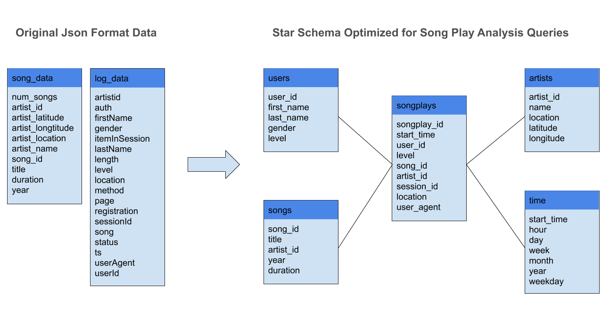

# Background
Udacity Project:

A startup called Sparkify wants to analyze the data they've been collecting on songs and user activity on their new music streaming app.

# Objective

Change the two directory of json files: song_data and log_data to a postgres database that faciliate the analytics team to understand what songs users are listening to.

# Steps
- Create tables for start schema

- Extract & transform data needed for the start schema from JSON files

- Insert data into table created

